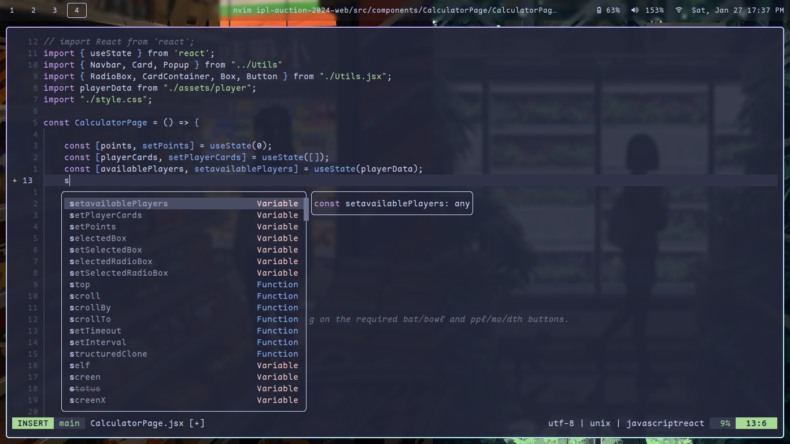
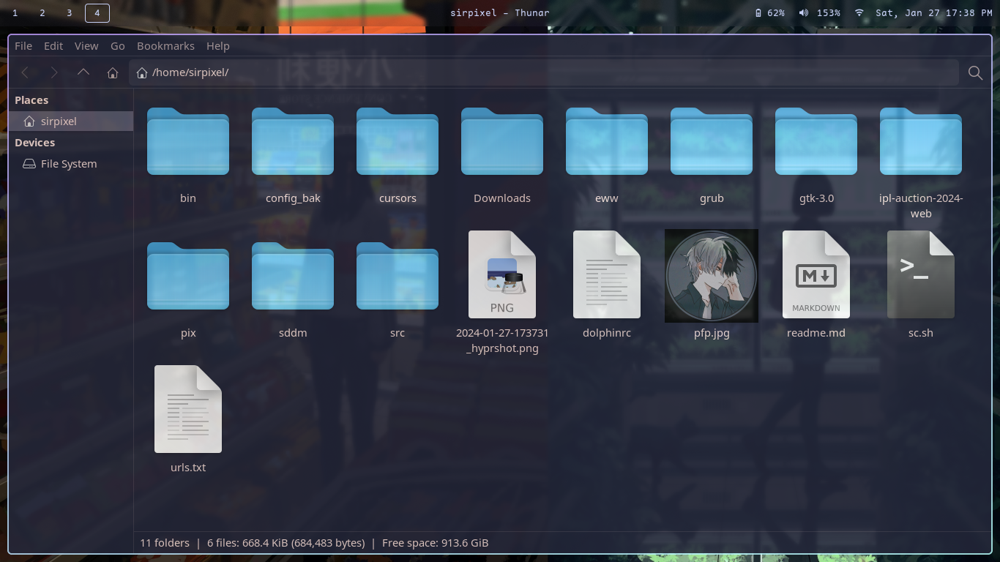

# Dotfiles
My configuration files for archlinux with hyprland. Inspired from [@TJ Devries](https://www.github.com/tjdevries/), [@ThePrimeagen](https://www.github.com/ThePrimeagen/), [@Eric Murphy](https://www.github.com/ericmurphyxyz/), [@Dark-Kernel](https://www.github.com/Dark-Kernel) (and me).
 
Mix of Gruvbox, material and lots of catppuccin style.
## Preview

